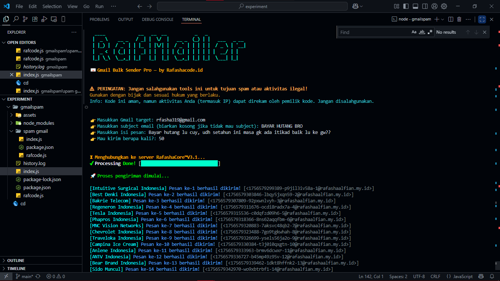
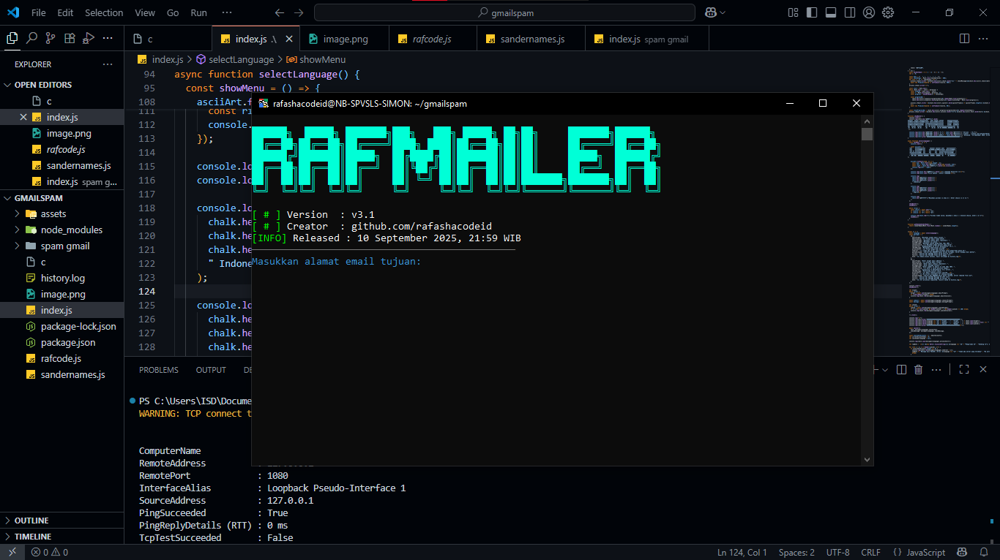
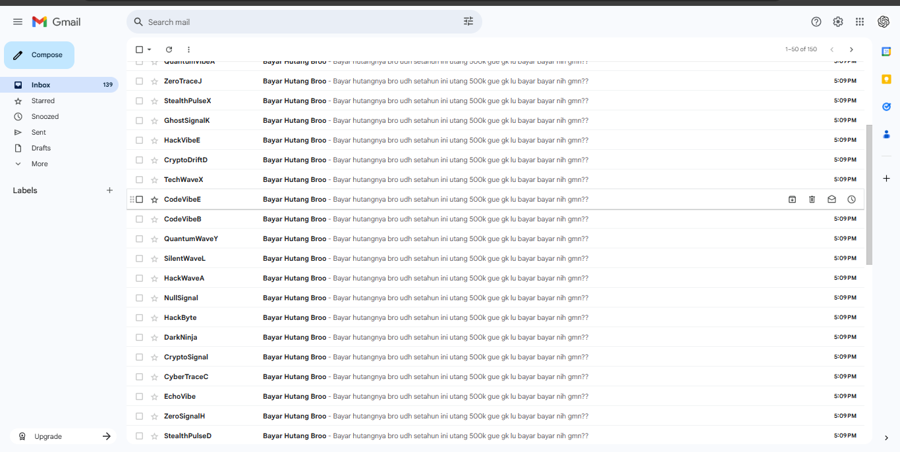
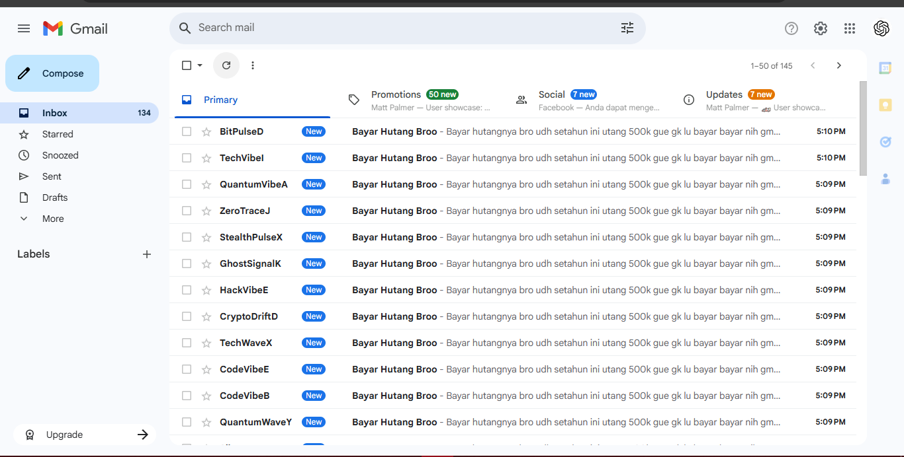

# RafMailer v3.1 - Alat Pengirim Email Gmail Massal 🚨

**RafMailer** adalah alat **CLI berbasis Node.js** untuk mengirim email massal via Gmail dengan **nama pengirim acak** dan **ID pesan unik**.  

⚠️ **Peringatan Penting**  
RafMailer dibuat untuk **keperluan pengujian dan otomatisasi**. Penyalahgunaan untuk **spam** atau aktivitas ilegal akan melanggar **kebijakan Gmail** serta **hukum yang berlaku**. Gunakan hanya untuk tujuan sah.  
Kami **tidak bertanggung jawab** atas penyalahgunaan alat ini.  

---

## ✨ Fitur
- 📧 **Pengiriman Email Massal** – Kirim banyak email ke satu penerima dengan cepat.  
- 👤 **Nama Pengirim Acak** – Nama pengirim diacak dari daftar bertema teknologi. 
- 🎨 **Antarmuka CLI Profesional** – Warna dari `chalk` + teks keren dari `figlet`.  
- 📝 **Pencatatan Log** – Riwayat pengiriman & error otomatis tersimpan di `history.log`.  

---

---








---

## 🛠️ Prasyarat
Pastikan sudah terpasang:
- [Node.js](https://nodejs.org/) **versi 16 atau lebih tinggi**  
- **NPM** (otomatis terpasang dengan Node.js)

---

## 📦 Instalasi

1. **Clone repositori**
   ```bash
   git clone https://github.com/rafashacodeid/rafmailer.git
    ```
   ```
   cd rafmailer
   ```
**Instal dependensi**

```bash
npm install
```
***Jalankan RafMailer***

```bash
npm start
```
⚠️ Peringatan
⏳ Batas Gmail – Gmail membatasi ~500 email/hari untuk akun gratis.

🔐 Keamanan – Jangan bagikan kredensial Gmail (index.js).

🚫 Penyalahgunaan – Spam/aktivitas ilegal bisa kena blokir atau masalah hukum.

📜 Lisensi
Proyek ini dilisensikan di bawah MIT License – lihat file LICENSE untuk detail.

